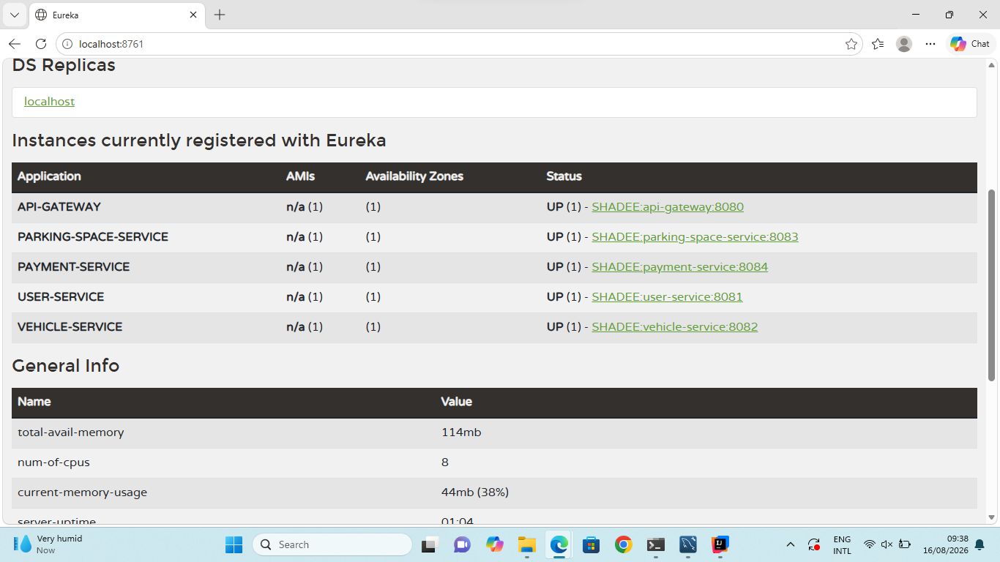

# 🚗 Smart Parking Management System

A backend-based **Smart Parking Management System** developed using **Spring Boot Microservices Architecture**. The system separates core parking operations into independent services, allowing each service to be developed, deployed, and maintained independently.

## 📌 Project Overview

The Smart Parking Management System is designed to manage users, vehicles, parking spaces, and payments through a distributed microservices architecture.

The project uses **Spring Boot, Spring Data JPA, MySQL, and  Eureka Service Discovery** to provide a scalable and modular backend system.

## 🏗️ Architecture

The system consists of the following services:

```text
                    ┌─────────────────────┐
                    │   Eureka Server     │
                    │      :8761          │
                    └──────────┬──────────┘
                               │
          ┌────────────────────┼────────────────────┐
          │                    │                    │
          ▼                    ▼                    ▼
 ┌────────────────┐   ┌────────────────┐   ┌────────────────────┐
 │  User Service  │   │ Vehicle Service│   │ Parking Space      │
 │     :8081      │   │     :8082      │   │ Service :8083      │
 └───────┬────────┘   └───────┬────────┘   └─────────┬──────────┘
         │                    │                      │
         ▼                    ▼                      ▼
    MySQL Database       MySQL Database         MySQL Database

                         ┌────────────────┐
                         │ Payment Service│
                         │     :8084      │
                         └───────┬────────┘
                                 │
                                 ▼
                            MySQL Database
```
## 📸 Eureka Server Dashboard



## 🧩 Microservices

### 1. User Service

**Port:** `8081`

Responsible for managing system users.

#### Main Features

* Create users
* Retrieve all users
* Retrieve user by ID
* Search user by email
* Update user details
* Delete users

#### Base URL

```text
http://localhost:8081/api/users
```

---

### 2. Vehicle Service

**Port:** `8082`

Responsible for managing vehicles registered in the parking system.

#### Main Features

* Register vehicles
* Retrieve all vehicles
* Retrieve vehicle by ID
* Update vehicle details
* Delete vehicles

#### Base URL

```text
http://localhost:8082/api/vehicles
```

---

### 3. Parking Space Service

**Port:** `8083`

Responsible for managing parking spaces and their availability.

#### Main Features

* Create parking spaces
* Retrieve all parking spaces
* Retrieve parking space by ID
* Update parking spaces
* Delete parking spaces
* Search parking spaces by status
* Search parking spaces by location

#### Base URL

```text
http://localhost:8083/api/parking-spaces
```

---

### 4. Payment Service

**Port:** `8084`

Responsible for managing parking-related payments.

#### Main Features

* Create payments
* Retrieve all payments
* Retrieve payment by ID
* Retrieve payments by user
* Retrieve payments by booking
* Delete payments

#### Base URL

```text
http://localhost:8084/api/payments
```

---

### 5. Eureka Server

**Port:** `8761`

The Eureka Server provides **service discovery** for the microservices.

Registered services include:

* User Service
* Vehicle Service
* Parking Space Service
* Payment Service

#### Eureka Dashboard

```text
http://localhost:8761
```

## 🛠️ Technologies Used

| Technology           | Purpose                            |
| -------------------- | ---------------------------------- |
| Java 21              | Programming Language               |
| Spring Boot 4.1.0    | Backend Framework                  |
| Spring Web MVC       | REST API Development               |
| Spring Data JPA      | Database Access                    |
| Hibernate            | ORM                                |
| MySQL                | Relational Database                |
| Spring Cloud         | Microservices Infrastructure       |
| Eureka       | Service Discovery                  |
| Maven                | Dependency Management & Build Tool |
| Spring Boot Actuator | Application Monitoring             |
| Jakarta Validation   | Data Validation                    |

## 🗄️ Database

The application uses separate MySQL databases for each microservice.

```text
user_service_db
vehicle_service_db
parking_space_service_db
payment_service_db
```

This follows the **Database-per-Service** approach commonly used in microservice architectures.

## 📂 Project Structure

```text
smart-parking-management-system/
│
├── eureka-server/
│   ├── src/
│   └── pom.xml
│
├── user-service/
│   ├── src/
│   │   └── main/
│   │       ├── java/
│   │       │   └── com.example.userservice/
│   │       │       ├── controller/
│   │       │       ├── entity/
│   │       │       ├── repository/
│   │       │       └── service/
│   │       └── resources/
│   └── pom.xml
│
├── vehicle-service/
│   ├── src/
│   └── pom.xml
│
├── parking-space-service/
│   ├── src/
│   └── pom.xml
│
├── payment-service/
│   ├── src/
│   └── pom.xml
│
├── pom.xml
└── README.md
```

## 🔌 REST API Endpoints

### User Service

| Method | Endpoint                   | Description       |
| ------ | -------------------------- | ----------------- |
| POST   | `/api/users`               | Create user       |
| GET    | `/api/users`               | Get all users     |
| GET    | `/api/users/{id}`          | Get user by ID    |
| GET    | `/api/users/email/{email}` | Get user by email |
| PUT    | `/api/users/{id}`          | Update user       |
| DELETE | `/api/users/{id}`          | Delete user       |

### Vehicle Service

| Method | Endpoint             | Description       |
| ------ | -------------------- | ----------------- |
| POST   | `/api/vehicles`      | Create vehicle    |
| GET    | `/api/vehicles`      | Get all vehicles  |
| GET    | `/api/vehicles/{id}` | Get vehicle by ID |
| PUT    | `/api/vehicles/{id}` | Update vehicle    |
| DELETE | `/api/vehicles/{id}` | Delete vehicle    |

### Parking Space Service

| Method | Endpoint                                  | Description             |
| ------ | ----------------------------------------- | ----------------------- |
| POST   | `/api/parking-spaces`                     | Create parking space    |
| GET    | `/api/parking-spaces`                     | Get all parking spaces  |
| GET    | `/api/parking-spaces/{id}`                | Get parking space by ID |
| PUT    | `/api/parking-spaces/{id}`                | Update parking space    |
| DELETE | `/api/parking-spaces/{id}`                | Delete parking space    |
| GET    | `/api/parking-spaces/status/{status}`     | Search by status        |
| GET    | `/api/parking-spaces/location/{location}` | Search by location      |

### Payment Service

| Method | Endpoint                            | Description             |
| ------ | ----------------------------------- | ----------------------- |
| POST   | `/api/payments`                     | Create payment          |
| GET    | `/api/payments`                     | Get all payments        |
| GET    | `/api/payments/{id}`                | Get payment by ID       |
| GET    | `/api/payments/user/{userId}`       | Get payments by user    |
| GET    | `/api/payments/booking/{bookingId}` | Get payments by booking |
| DELETE | `/api/payments/{id}`                | Delete payment          |

## ⚙️ Prerequisites

Before running the project, make sure you have installed:

* Java 21
* Maven
* MySQL Server
* MySQL Workbench (optional)
* IntelliJ IDEA or another Java IDE
* Git

Verify Java installation:

```bash
java -version
```

Verify Maven installation:

```bash
mvn -version
```

## 🗃️ MySQL Database Setup

Create the required databases in MySQL:

```sql
CREATE DATABASE user_service_db;
CREATE DATABASE vehicle_service_db;
CREATE DATABASE parking_space_service_db;
CREATE DATABASE payment_service_db;
```

Then configure the database credentials in each service's `application.properties`.

**Do not commit real database passwords to GitHub.**

Recommended configuration:

```properties
spring.datasource.url=jdbc:mysql://localhost:3306/user_service_db
spring.datasource.username=${DB_USERNAME}
spring.datasource.password=${DB_PASSWORD}
```

## 🚀 How to Run

### 1. Clone the Repository

```bash
git clone <YOUR_GITHUB_REPOSITORY_URL>
cd smart-parking-management-system
```

### 2. Start Eureka Server

Navigate to:

```text
eureka-server
```

Run:

```bash
mvn spring-boot:run
```

Eureka Server will start on:

```text
http://localhost:8761
```

### 3. Start User Service

```bash
cd user-service
mvn spring-boot:run
```

Runs on:

```text
http://localhost:8081
```

### 4. Start Vehicle Service

```bash
cd vehicle-service
mvn spring-boot:run
```

Runs on:

```text
http://localhost:8082
```

### 5. Start Parking Space Service

```bash
cd parking-space-service
mvn spring-boot:run
```

Runs on:

```text
http://localhost:8083
```

### 6. Start Payment Service

```bash
cd payment-service
mvn spring-boot:run
```

Runs on:

```text
http://localhost:8084
```

## 🔍 Service Discovery

After starting all services, open:

```text
http://localhost:8761
```

The Eureka dashboard should display the registered services.

```text
USER-SERVICE
VEHICLE-SERVICE
PARKING-SPACE-SERVICE
PAYMENT-SERVICE
```

## 🧪 Testing

The REST APIs can be tested using:

* Postman
* Insomnia
* IntelliJ HTTP Client
* cURL

Example:

```http
GET http://localhost:8081/api/users
```

Example:

```http
GET http://localhost:8082/api/vehicles
```

Example:

```http
GET http://localhost:8083/api/parking-spaces
```

Example:

```http
GET http://localhost:8084/api/payments
```

## 📊 Architecture Benefits

This project demonstrates several important microservice concepts:

* **Service Independence** – Each business functionality is implemented as an independent service.
* **Service Discovery** – Eureka enables services to register and discover each other.
* **Database per Service** – Each service maintains its own database.
* **RESTful APIs** – Services expose REST endpoints for CRUD operations.
* **Separation of Concerns** – Controller, Service, Repository, and Entity layers are separated.
* **Independent Scalability** – Individual services can be scaled independently.
* **Maintainability** – Changes to one service can be made without tightly coupling the entire system.

## 🔐 Security Note

Database credentials should be stored using environment variables or external configuration rather than directly inside `application.properties`.

Example:

```properties
spring.datasource.username=${DB_USERNAME}
spring.datasource.password=${DB_PASSWORD}
```

Never commit passwords, API keys, tokens, or other secrets to a public GitHub repository.

## 📈 Future Improvements

Possible future enhancements include:

* API Gateway
* Centralized Config Server
* Authentication and Authorization using JWT
* Role-based access control
* Parking reservation and booking service
* Real-time parking availability
* Payment gateway integration
* Docker containerization
* Centralized logging
* Distributed tracing
* OpenAPI / Swagger documentation
* Frontend application
* Automated CI/CD pipeline

## 👩‍💻 Author

**Tharushi Shadeera**

Software Engineering Undergraduate

### ⭐ Project

**Smart Parking Management System**

Built using **Java, Spring Boot, Spring Cloud, MySQL, JPA, Hibernate, and  Eureka**.
